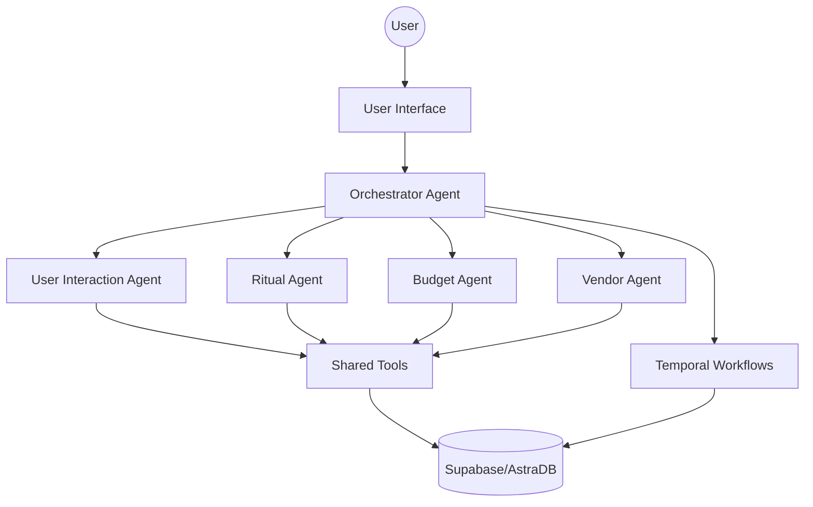
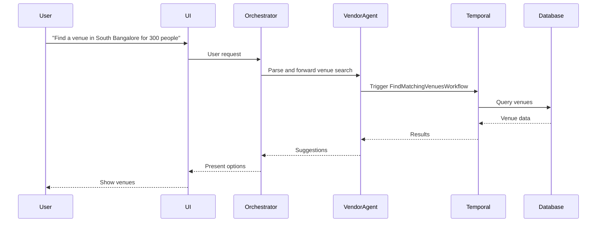

# Enhancements for AI Agent Architecture Documentation

This document provides enhancements to the existing AI agent architecture, focusing on diagrams, example API schemas, and explicit error/edge-case handling strategies.

---

## 1. Architecture Diagrams

### 1.1 High-Level System Diagram



### 1.2 Example Workflow Sequence (Venue Search)



---

## 2. Example API Schemas

### 2.1 Venue Search API (Internal Agent Call)

```json
{
  "location": "South Bangalore",
  "capacity": 300,
  "style": "Modern",
  "budget_min": 500000,
  "budget_max": 700000,
  "event_date": "2025-06-15"
}
```

#### Response
```json
[
  {
    "id": "venue_001",
    "name": "Grand Ballroom",
    "location": "South Bangalore",
    "capacity": 500,
    "style": "Modern",
    "price_per_plate_veg": 1200,
    "price_per_hall_rental": 200000,
    "is_available": true,
    "portfolio_url": "http://example.com/grand_ballroom"
  }
]
```

### 2.2 Error Response Schema

```json
{
  "error": {
    "type": "ValidationError",
    "message": "Capacity must be a positive integer."
  }
}
```

---

## 3. Error & Edge-Case Handling Strategies

### 3.1 User Input Validation
- Validate all incoming user data (e.g., required fields, data types, value ranges).
- Return structured error messages for invalid input.

### 3.2 Agent/Tool Failures
- Use try/catch (or equivalent) blocks around all external API/tool calls.
- On failure, log the error, return a user-friendly message, and escalate to a human if needed.
- Implement retries for transient errors (e.g., network issues).

### 3.3 Workflow Timeouts & Retries
- Set reasonable timeouts for all Temporal activities.
- Use Temporal's built-in retry policies for idempotent operations.
- For non-idempotent or user-facing actions, escalate after a set number of retries.

### 3.4 Human-in-the-Loop Escalation
- If an agent cannot resolve an issue (e.g., no vendors found, repeated tool failures), flag the case for manual review.
- Provide clear audit logs and context for human operators.

### 3.5 Data Consistency
- Ensure all agents use shared data models and schemas.
- Validate data at boundaries (e.g., before writing to DB, before presenting to user).

---

## 4. Example: Error Handling in Venue Search (Pseudocode)

```python
def search_venues(criteria):
    try:
        validate_criteria(criteria)
        results = db.query_venues(criteria)
        if not results:
            return {"error": {"type": "NoResults", "message": "No venues found matching your criteria."}}
        return results
    except ValidationError as ve:
        return {"error": {"type": "ValidationError", "message": str(ve)}}
    except Exception as e:
        log_error(e)
        escalate_to_human(criteria, e)
        return {"error": {"type": "InternalError", "message": "An unexpected error occurred. Our team has been notified."}}
```

---

## 5. Recommendations
- Add these diagrams and schemas to your main documentation for clarity.
- Use consistent error response formats across all agents and tools.
- Document escalation and manual intervention procedures for operators.
- Regularly review and update error handling as the system evolves.
